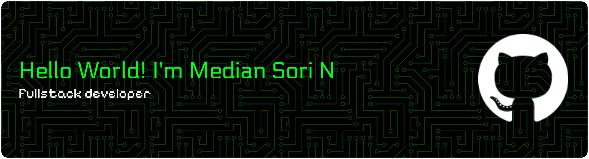

##### Skills

##### Connect With Me

 

My name is Median Sori N and I am a sixth-semester Information Systems student at the University of Bengkulu with a strong interest in information technology and programming. I continuously develop my technical and analytical skills through self-learning and projects, and I am committed to growing my expertise in technology and software development.

###

<h2 align="left">Skills</h2>

###

  
  
  
  
  
  
  
  
  
  
  
  
  
  
  
  
  
  
  
  
  
  
  
  
  
  
  
  
  

###

  
  

###

<picture>
  <source media="(prefers-color-scheme: dark)" srcset="https://raw.githubusercontent.com/median0105/median0105/output/pacman-contribution-graph-dark.svg">
  <source media="(prefers-color-scheme: light)" srcset="https://raw.githubusercontent.com/median0105/median0105/output/pacman-contribution-graph.svg">
  
</picture>

###
